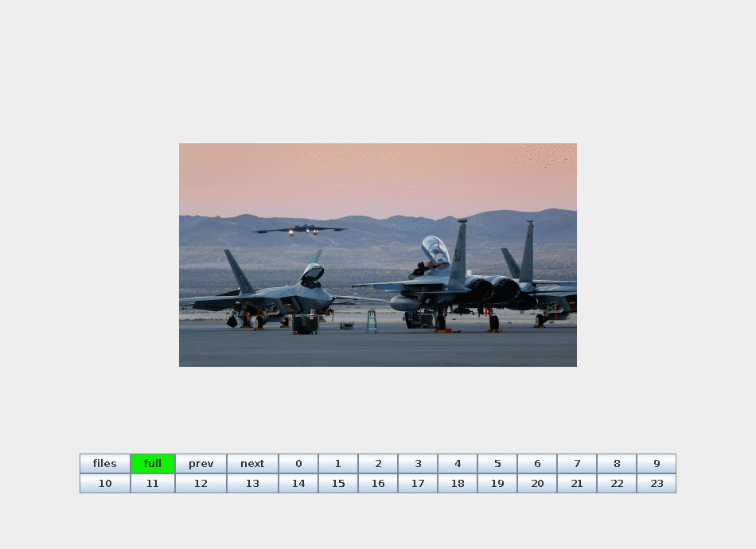
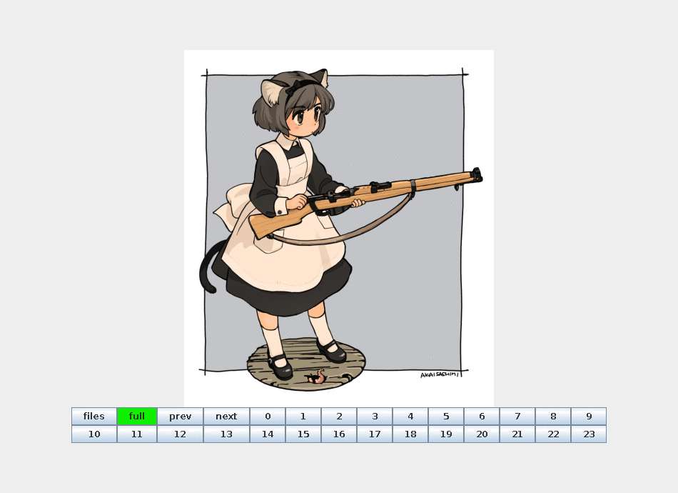

# BitSliceViewer
A simple gui to display 24 bit image bit-planes

## Screenshots
### NOTE: Screenshot UI is outdated, but the overall functionality is accurate.
### Photograph

### Artwork

## Download
Download the latest version from the releases page:

https://github.com/noodles623/BitSliceViewer/releases
## Usage
Requires the latest Java version.

This program is designed for 24 bit-per-pixel bitmap images.
To convert an image to 24bpp bitmap using imagemagick, use the following command:
> convert myimage.xxx -type truecolor myimage.bmp

The image you select MUST be a 24 bit-per-pixel bitmap. The program will not function otherwise.

Please do not press buttons while the image is loading.

The image must be releoaded when switching between CGC and PCB encoding.

### Note about efficiency
The code used to write this program will form the backbone of a full-fledged android steganography applicaiton.
This program sacrifices performance in exchange for a more flexible codebase. Multi-threading is used to increase
performance.

### TODO List
* Add PBC to CGC display support
* Loading screen does not display properly
* Unsafe behavior when pressing buttons as image loads
* Button highlightin doesn't properly reset when loading new image
