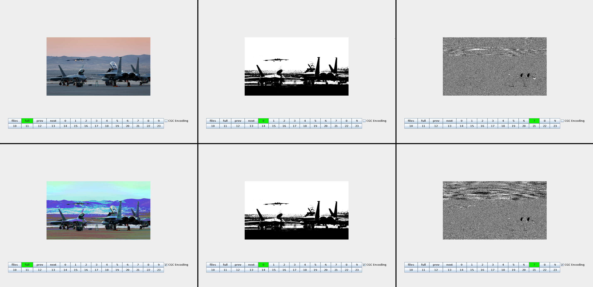

# BitSliceViewer
A simple gui to display 24 bit image bit-planes in PCB and CGC mode

## Screenshots
### PCB and CGC comparison

#### NOTE: Planes 0,8,16 are identical in PCB and CGC modes
## Download
Download the latest version from the releases page:

https://github.com/noodles623/BitSliceViewer/releases
## Usage
Requires the latest Java version.

This program is designed for 24 bit-per-pixel bitmap images.
To convert an image to 24bpp bitmap using imagemagick, use the following command:
> convert myimage.xxx -type truecolor myimage.bmp

The image you select MUST be a 24 bit-per-pixel bitmap. The program will not function otherwise.

Pre-converted 24-bit images can be found in the Sample Images folder.

Please do not press buttons while the image is loading.

The image must be releoaded when switching between CGC and PCB encoding.

### TODO List
* Loading screen does not display properly
* Unsafe behavior when pressing buttons as image loads
* Button highlighting doesn't properly reset when loading new image
